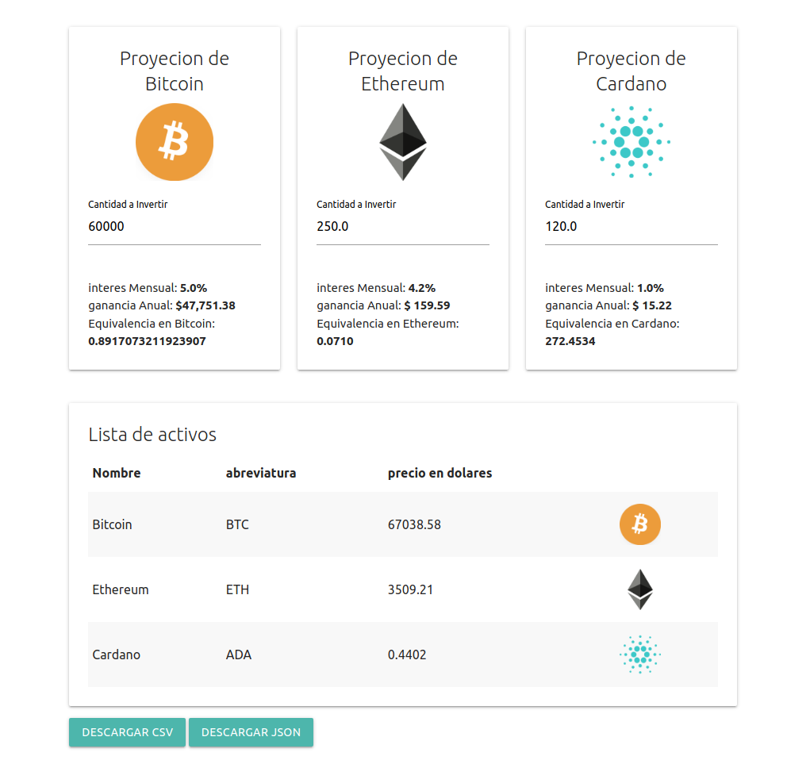

# Documentación para la Configuración del Proyecto Ruby on Rails v7
## Preparativos
### Antes de ejecutar el proyecto, hay varios comandos que debería ejecutar para asegurarse de que tiene todas las dependencias necesarias y que su base de datos está actualizada.

## Instalación de las Dependencias

### Use el siguiente comando para instalar todas las gemas necesarias listadas en su Gemfile:

``` bundle install ```

### Migración de la Base de Datos

Ejecute el siguiente comando para realizar cualquier migración pendiente en su base de datos:

``` rails db:migrate ```

### Importación de los Datos CSV

Si tiene un archivo CSV que desea importar a su base de datos, puede usar el comando Rake. Reemplace 'public/csvs/origen.csv' con la ruta de su archivo CSV.

``` rake csv_import:import['public/csvs/origen.csv'] ```

### Precompilación de los Activos

Use el siguiente comando para precompilar sus activos para producción:

``` rake assets:precompile ```

### Instalación de la API Key
Necesitará configurar su API key en las credenciales de Rails. Siga los siguientes pasos:

Edite sus Credenciales

Para editar sus credenciales, utilice el siguiente comando:

``` rails credentials:edit ```

### Añada su API Key

Añada su API key en el formato siguiente:

``` coinapi_key: xxxxxxxxxxxxxxxxxxxx ```

### Inicio del Proyecto
Una vez que ha completado todos los pasos anteriores, está listo para iniciar su proyecto. Use el siguiente comando para iniciar su servidor de Rails:

``` rails s ```



